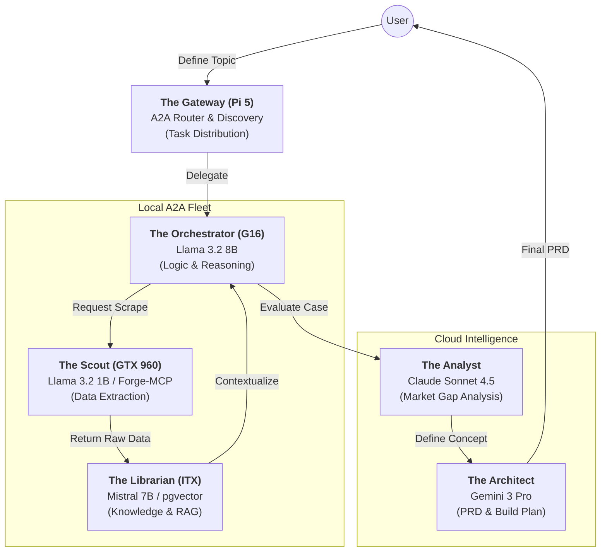

# Forge-MCP Orchestrator - Product Requirements Document

## 1. Executive Summary

Forge-MCP is a high-performance, Rust-native Model Context Protocol (MCP) server designed to equip AI agents with dynamic logic and long-term vector memory. It acts as a universal local gateway, plugging into multiple MCP clients (Claude Desktop, Cursor/Antigravity) simultaneously.

The core value proposition is **decoupled orchestration**: it provides agents with the ability to instantly recall massive datasets (RAG), execute specialized Standard Operating Procedures (Agent MD Skills), and delegate work to heterogeneous sub-agents (cloud and local GPU) — reducing token costs and bypassing the latency of Python-based frameworks.

**Current State:** Phase 2 Complete ✅ — Phase 3 (A2A Distributed Fleet) planned.

---

## 2. Mission

**Mission Statement:** Build the fastest, most resource-efficient local MCP gateway to supercharge IDE-based agents with private memory, modular skills, and distributed multi-agent orchestration.

### Core Principles

1.  **Client-Agnostic MCP** — Works with Claude Desktop, Cursor, and Antigravity via `stdio` with zero code changes.
2.  **Ultra-Low Latency** — Built in Rust to ensure tool-call routing overhead remains under 50ms.
3.  **Local Sovereign Memory** — All embeddings and database records remain strictly on the user's local machine via PostgreSQL.
4.  **Logic as Content** — Agent behaviors are defined in plain `.md` files, separating business logic from the compiled Rust binary.
5.  **Hybrid Compute** — Cloud models for reasoning, local GPU for grunt work, configurable per-task.

---

## 3. Target Users

### Primary Persona: The Agent Architect

-   **Who:** Developers and system architects building multi-agent workflows across heterogeneous hardware.
-   **Goals:**
    -   Give their agents persistent, long-term memory across sessions.
    -   Delegate work to the cheapest appropriate compute (local GPU vs cloud).
    -   Standardize agent behavior using version-controlled Markdown files.
-   **Pain Points:**
    -   Cloud-based RAG pipelines are expensive and slow.
    -   Context windows get cluttered when passing raw data instead of performing semantic searches.
    -   No unified way to orchestrate local and cloud agents from one place.

---

## 4. System Architecture

### Current Architecture (Phase 2 — Complete)

```
┌──────────────────┐     stdio      ┌──────────────────┐      SQL       ┌──────────────────┐
│  Claude Desktop  │ ◄────────────► │    Forge-MCP     │ ◄────────────► │   PostgreSQL     │
│  / Cursor        │    JSON-RPC    │   (Rust Core)    │                │   w/ pgvector    │
│  (MCP Client)    │                │                  │                │   (Port 5454)    │
└──────────────────┘                └───────┬──────────┘                └──────────────────┘
                                            │
                              ┌─────────────┼─────────────┐
                              │             │             │
                     ┌────────▼───┐  ┌──────▼─────┐  ┌───▼──────────┐
                     │  Skills    │  │ fastembed   │  │ Sub-Agents   │
                     │  Engine    │  │ (CPU embed) │  │ (spawn_agent)│
                     │ ./skills/  │  └────────────┘  └───┬──────────┘
                     └────────────┘                      │
                                            ┌────────────┼────────────┐
                                            │                         │
                                   ┌────────▼────────┐     ┌─────────▼────────┐
                                   │  Gemini CLI     │     │  Llama 3.2 1B    │
                                   │  (Cloud, 5      │     │  (Local GPU,     │
                                   │   models)       │     │   GTX 960/CUDA)  │
                                   └─────────────────┘     └──────────────────┘
```

### Key Components

1.  **Forge-MCP Server Core (`main.rs`)**
    -   Async `tokio::spawn` per-request concurrency with `mpsc` stdout flush channel.
    -   Routes tool calls to sub-agents via configurable `config/agents.json`.

2.  **Database (PostgreSQL + pgvector)**
    -   Stores embedded text chunks and long-term agent memory.
    -   Semantic search via cosine distance (`<=>` operator).

3.  **Sub-Agent Orchestration**
    -   **Gemini CLI** (`gemini -p`) — 5 cloud models from Flash Lite to 3 Pro.
    -   **Llama Local** (`llama-agent.sh`) — Local GPU inference via Docker/llama.cpp, zero API cost.
    -   Configurable per-request: `agent_type` + `model` parameters.

4.  **Skills Engine**
    -   Hot-loaded Markdown SOPs from `./skills/` directory.
    -   Injected as system context into sub-agents at spawn time.

---

## 5. Features

### 5.1 Local Context Memory (RAG) ✅
-   Converts text into vector embeddings via `fastembed-rs` (BGE-Small-EN-v1.5, CPU).
-   Semantic search returns top-N most relevant chunks from PostgreSQL.

### 5.2 Dynamic Skill Injection ✅
-   Hot-swappable Markdown SOPs in `./skills/`.
-   Skills are version-controlled and portable across teams.

### 5.3 Multi-Client MCP Interface ✅
-   Works with Claude Desktop, Cursor, and Antigravity simultaneously.
-   JSON-RPC 2.0 over `stdio` transport.

### 5.4 Multi-Agent Spawning (Phase 2) ✅
-   **`spawn_agent`** delegates tasks to cloud (Gemini) or local (Llama) sub-agents.
-   **`list_models`** exposes available agent backends and models from `config/agents.json`.
-   **`index_workspace`** crawls codebases into vector memory for RAG.
-   Agent config is externalized — add new backends without recompiling.

### 5.5 A2A Distributed Fleet (Phase 3) 🔜
-   See Section 8 below.

---

## 6. Technology Stack

### Backend
| Component | Technology | Role |
|-----------|------------|------|
| Framework | Rust / Tokio | High-concurrency async runtime |
| Database | PostgreSQL + pgvector | Persistent storage + semantic search |
| Protocol | MCP (JSON-RPC 2.0) | Model Context Protocol over stdio |
| DB Driver | sqlx | Async SQL with compile-time checks |

### AI / Intelligence Layer
| Component | Technology | Role |
|-----------|------------|------|
| Embeddings | fastembed-rs (BGE-Small) | Local CPU text-to-vector |
| Cloud Agents | Gemini CLI (5 models) | High-reasoning tasks via Google |
| Local Agents | Llama 3.2 1B (llama.cpp/CUDA) | Free local GPU inference |

### Client Environment
| Component | Technology | Role |
|-----------|------------|------|
| IDE Clients | Claude Desktop, Cursor, Antigravity | MCP host / orchestrator |
| Transport | stdio | JSON-RPC communication bridge |
| Agent Config | `config/agents.json` | Hot-swappable agent registry |

---

## 7. API Specification

### MCP Tools

| Tool | Inputs | Description |
|------|--------|-------------|
| `save_to_memory` | `content`, `tags[]` | Vectorize + store in pgvector |
| `search_memory` | `query`, `limit` | Semantic search over memory |
| `list_agent_skills` | — | List available skill SOPs |
| `read_skill` | `skill_name` | Return skill markdown content |
| `spawn_agent` | `skill_name`, `goal`, `agent_type?`, `model?` | Delegate to sub-agent with skill context |
| `list_models` | `agent_type?` | List agent backends and models |
| `index_workspace` | `directory` | Crawl + embed codebase into RAG |

---

## 8. Phase 3: A2A Distributed Fleet

### 8.1 Overview

Phase 3 evolves Forge-MCP from a single-machine MCP server into a node within a **distributed Agent-to-Agent (A2A) fleet**. The [A2A Protocol](https://a2a-protocol.org) (Google/Linux Foundation, 2025) enables agents across different machines to discover, delegate, and collaborate over HTTP — complementing MCP's vertical tool integration with horizontal agent-to-agent communication.

**MCP = agent ↔ tools (vertical) | A2A = agent ↔ agent (horizontal)**

### 8.2 Fleet Topology



### 8.3 Fleet Nodes

| Node | Role | Hardware | Model / Tool | A2A Skills |
|:-----|:-----|:---------|:-------------|:-----------|
| **Gateway** | Task Routing / Discovery | Raspberry Pi 5 | A2A Router (FastAPI) | `route_task`, `discover_agents` |
| **Orchestrator** | Logic / Reasoning | ASUS ROG G16 | Llama 3.2 8B | `plan`, `coordinate`, `evaluate` |
| **Librarian** | Context / RAG | Mini-ITX (RTX 3050) | Mistral 7B + pgvector | `vector_search`, `embed`, `contextualize` |
| **Scout** | Scraping / Grunt Work | Desktop (GTX 960) | Llama 3.2 1B + Forge-MCP | `web_scrape`, `extract`, `summarize` |
| **Analyst** | Market Analysis | Cloud (Anthropic) | Claude Sonnet 4.5 | `analyze_gaps`, `rank_opportunities` |
| **Architect** | PRD Generation | Cloud (Google) | Gemini 3 Pro | `draft_prd`, `design_architecture` |

### 8.4 A2A Protocol Integration

Each fleet node will implement the A2A standard:

1.  **Agent Cards** — Every node serves `/.well-known/agent.json` advertising its identity, capabilities, supported skills, and authentication requirements.
2.  **HTTP Transport** — A2A uses HTTP/HTTPS for inter-node communication (replacing MCP's stdio for cross-machine calls).
3.  **JSON-RPC 2.0** — Same wire protocol Forge-MCP already uses, ensuring minimal migration friction.
4.  **Server-Sent Events (SSE)** — For streaming long-running task status updates between nodes.
5.  **Task Lifecycle** — Structured task delegation with states: `submitted → working → completed/failed`.

### 8.5 Implementation Roadmap

#### Phase 3a: Forge-MCP as A2A Node
-   [ ] Add HTTP server alongside existing stdio transport (Actix-Web or Axum).
-   [ ] Implement `/.well-known/agent.json` Agent Card endpoint.
-   [ ] Expose existing MCP tools as A2A skills over HTTP.
-   [ ] Add A2A task lifecycle management (submit, poll, complete).

#### Phase 3b: Gateway (Pi 5)
-   [ ] Build lightweight A2A router on Raspberry Pi 5 (Python FastAPI or Rust).
-   [ ] Implement agent discovery via LAN scan or static registry.
-   [ ] Route tasks to fleet nodes based on hardware capability and current load.
-   [ ] Act as firewall for external requests.

#### Phase 3c: Fleet Workers
-   [ ] Deploy Orchestrator node on G16 (Llama 3.2 8B, session state management).
-   [ ] Deploy Librarian node on ITX (Mistral 7B + pgvector, centralized RAG).
-   [ ] Integrate Cloud Tier agents (Claude + Gemini) as remote A2A endpoints.
-   [ ] Wire up the full Research Loop: Scout → Librarian → Orchestrator → Analyst → Architect.

#### Phase 3d: The Research Loop
-   [ ] Scout executes Google Play Store scraping via custom scrapers.
-   [ ] Librarian cleans, embeds, and stores scraped data in vector DB.
-   [ ] Orchestrator queries Librarian for trends, coordinates with Cloud Tier.
-   [ ] Analyst (Claude) identifies viable market gaps and ranks opportunities.
-   [ ] Architect (Gemini) drafts the final technical PRD and build plan.

### 8.6 Networking Requirements
-   All local nodes on the same subnet with static IPs or local DNS (e.g., `scout.local`, `gateway.local`).
-   Internal A2A traffic unauthenticated for performance; Gateway acts as external firewall.
-   Cloud Tier agents accessed via API keys managed by the Orchestrator.